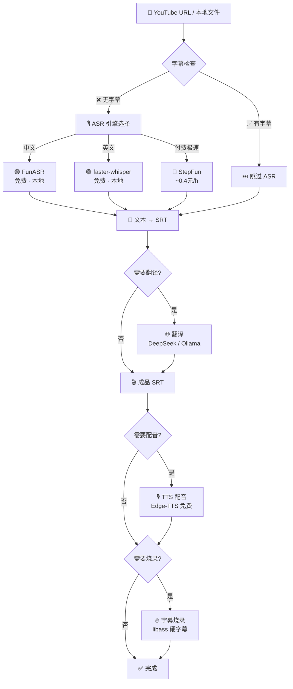

# Everyones Video — 视频字幕全管线 🎬

[](LICENSE)
[](https://github.com/hanshaoyuyehanshaoyuye/everyones-video)
[](https://github.com/hanshaoyuyehanshaoyuye/everyones-video/blob/main/tests/test_core.py)
[](https://python.org)
[](https://hub.docker.com)

> **省钱第一，速度第二，精度第三。**  /  Free first, fast second, precise third.

一句话加字幕，一条命令出片。Claude Code 里说"给视频加字幕"全自动搞定，也能 Docker 部署成 API 服务器、接入 CI/CD 批量处理。**一套代码，创作者到团队全场景覆盖。**

One command from YouTube / local file to finished subtitled video. A Claude Code community skill AND a standalone CLI.

---

## 为什么选 everyones-video

**免费优先、MIT 许可、Docker 就绪、安全加固 — 四张牌在赛道里同时具备的只有我们。**

| 能力 | everyones-video | pyvideotrans | VideoLingo | Mazinger | jianshuo/skills |
|------|:--:|:--:|:--:|:--:|:--:|
| **许可** | **MIT** | GPL-3.0 | Apache 2.0 | 待确认 | MIT |
| **整管线 ¥0 跑通** | **✅** | 需配 API | 需配 API | 需配 API | 需配 API |
| **Docker + API Server** | **✅** | — | — | — | — |
| **安全加固** | **✅** | — | — | — | — |
| **Claude Code 技能** | **✅ 4 个** | — | — | — | ✅ 15 个 |
| 说话人分离 | ✅ FunASR | ✅ | ✅ | — | — |
| 翻译质量反思 | ✅ GEMBA-MQM修复 | — | ✅ 3步 | — | — |
| 翻译质量评估 | ✅ GEMBA-MQM | — | — | — | — |
| 语音克隆 | — Edge-TTS | ✅ 3引擎 | — | — | — |

> **MIT 许可：** 嵌入产品、SaaS 服务、二次开发 — 都无需开源你的代码。
>
> **Docker 部署：** 跑在服务器上、集成到 CI/CD、被其他工具调用 — 从本机工具到平台组件。

同赛道还有很多优秀项目：[pyvideotrans](https://github.com/jianchang512/pyvideotrans)（18k★，GUI + 声克隆）、[VideoLingo](https://github.com/Huanshere/VideoLingo)（17.5k★，Netflix 级字幕质量）、[Mazinger](https://github.com/bakrianoo/mazinger)（10 段式管线）、[jianshuo/claude-skills](https://github.com/jianshuo/claude-skills)（15 个视频创作技能）。各有千秋，按需选择。

---

## 五分钟效果

**Before:** 一个没字幕的英文教程视频，需要 30 分钟手动操作、花几十元调 API。

**After:** 一条命令，已有字幕时秒级完成，¥0。

```bash
bash integration/pipeline.sh "https://youtube.com/watch?v=dQw4w9WgXcQ" --translate --dub --burn
```

```text
════════════════════════════════════
 视频字幕管线
 语言: zh | ASR: auto
 翻译: true | 反思: false | 配音: true | 烧录: true
════════════════════════════════════

═══ Step 1: 提取音频 + 字幕检查 ═══
  → 检查 YouTube 自动字幕...
  🎯 找到已有字幕！跳过 ASR (省时省钱)
  → subtitles.srt (142 条字幕)

═══ Step 2: ASR 转写 — 跳过 (已有字幕) ═══

═══ Step 3: 文本 → SRT — 跳过 (已有 SRT) ═══

═══ Step 4: 翻译字幕 ═══
  → subtitles_translated.srt (142 条)

═══ Step 5: TTS 配音 ═══
  → dub.mp3

═══ Step 6: 烧录字幕 ═══
  → tutorial_subtitled.mp4

════════════════════════════════════
 完成！
════════════════════════════════════
```

---

## 流程图



---

## 安装

### 方式 1：git clone（推荐）

```bash
git clone https://github.com/hanshaoyuyehanshaoyuye/everyones-video ~/.claude/skills/everyones-video
```

### 方式 2：ClawHub 安装 `[即将上线]`

```bash
clawhub install everyones-video
```

### 方式 3：Claude Code marketplace `[即将上线]`

```bash
claude plugin marketplace add hanshaoyuyehanshaoyuye/everyones-video
claude plugin install everyones-video
```

### 方式 4：独立工具（不需要 Claude Code）

```bash
git clone https://github.com/hanshaoyuyehanshaoyuye/everyones-video
cd everyones-video && pip install -r requirements.txt
```

---

## 引擎对比

| 引擎 | 价格 | 中文 | 英文 | 速度 | 时间戳 | 离线 |
|------|:--:|:--:|:--:|:--:|:--:|:--:|
| **FunASR** 阿里达摩院 | 🟢 免费 | ⭐⭐⭐ | ⭐ | ~15× | ✅ | ✅ |
| **faster-whisper** CTranslate2 | 🟢 免费 | ⭐⭐ | ⭐⭐⭐ | ~50× | ✅ | ✅ |
| yt-dlp 字幕提取 | 🟢 免费 | — | — | 1s | ✅ | ❌ |
| StepFun | ~0.4元/h | ⭐⭐ | ⭐⭐ | ~90× | ❌ | ❌ |
| 豆包 Volcano | 付费 | ⭐⭐⭐ | — | ~20× | ✅ | ❌ |
| Whisper API | $0.006/min | ⭐⭐ | ⭐⭐⭐ | ~15× | ✅ | ❌ |

> 详 [docs/ASR_COMPARISON.md](docs/ASR_COMPARISON.md)

---

## 快速上手

### 1. 装依赖

```bash
# 轻量核心（推荐 — 几十 MB，无模型下载）
pip install -r requirements.txt

# 完整版（需离线 ASR 再加这个 — FunASR ~1GB + faster-whisper ~74MB+）
pip install -r requirements-full.txt

# 检查环境
bash smoke_test.sh
```

| 安装方式 | 大小 | 能做什么 |
|------|------|------|
| `requirements.txt` | ~20MB | YouTube 字幕 + 翻译 + 配音 + 烧录 |
| `+ requirements-full.txt` | + ~2GB 模型 | 上面全部 + 离线 ASR（无需网络也能转写） |

### 2. 跑第一个视频

```bash
# YouTube → 自动字幕优先（80% 场景零成本）
bash integration/pipeline.sh "https://youtube.com/watch?v=dQw4w9WgXcQ"

# 翻译 + 配音 + 烧录
bash integration/pipeline.sh ~/tutorial.mp4 --lang en --translate --dub --burn

# 只预览不执行
bash integration/pipeline.sh ~/audio.mp3 --dry-run
```

### 3. 单独用某个模块

```bash
# 翻译 SRT
python3 integration/translate_srt.py input.srt --to en --bilingual

# 纯文本转 SRT
python3 integration/text_to_srt.py transcript.txt --lang zh -o output.srt

# SRT → TTS 配音
python3 integration/tts_dub.py subtitles.srt --lang zh-CN -o dub.mp3

# 烧字幕 + 配音到视频
python3 skills/wjs-burning-subtitles/scripts/render.py \
    --video in.mp4 --srt subs.srt --dub dub.mp3 --out out.mp4
```

### 4. 换翻译后端

任何 OpenAI 兼容接口都能用，换三个环境变量即可：

```bash
# 用 OpenAI
export TRANSLATE_API_BASE=https://api.openai.com
export TRANSLATE_MODEL=gpt-4o-mini
export DEEPSEEK_API_KEY=sk-...

# 用阿里通义千问
export TRANSLATE_API_BASE=https://dashscope.aliyuncs.com/compatible-mode/v1
export TRANSLATE_MODEL=qwen-plus
export DEEPSEEK_API_KEY=sk-...

# 用本地 Ollama
export TRANSLATE_API_BASE=http://127.0.0.1:11434/v1
export TRANSLATE_MODEL=qwen3:14b
# 不需要 API key
```

也支持 `--api-key` 参数直传，不用环境变量。

### 5. 启动 API 服务器

```bash
export DEEPSEEK_API_KEY=sk-...
export TRANSLATE_API_TOKEN=my-secret-token
python3 integration/translate_srt.py --server --port 8730
```

```bash
# 调用 API
curl -H "Authorization: Bearer my-secret-token" \
     -H "Content-Type: application/json" \
     -d '{"srt":"1\n00:00:00,000 --> 00:00:05,000\nHello world\n","to":"zh-CN"}' \
     http://127.0.0.1:8730/translate
```

### 6. 批量处理

```bash
bash integration/batch_pipeline.sh ~/videos/ --lang zh --translate --parallel 4
```

### 7. 质量评估

```bash
python3 integration/eval_quality.py source.srt translated.srt --from en --to zh-CN
```

---

## 10 个场景

| # | 场景 | 成本 | 引擎 |
|---|------|------|------|
| 1 | YouTube 英文教程 → 中英双语 | ¥0 | yt-dlp 字幕 |
| 2 | 中文会议录音 → 文字纪要 | ¥0 | FunASR |
| 3 | 中文短视频 → 英文版出片 | ¥0~0.01 | FunASR |
| 4 | 批量 100 个视频 → 字幕 | ~¥15 | 豆包 |
| 5 | 播客 MP3 → 文字稿 + 时间轴 | ¥0 | FunASR |
| 6 | 直播切片 → 快速出片 | ¥0~0.01 | FunASR |
| 7 | 1 视频 → 5 语言字幕 | ~¥0.03 | DeepSeek |
| 8 | 纯本地离线（零网络） | ¥0 | FunASR |
| 9 | 30 秒语音 → 入门测试 | ¥0 | FunASR |
| 10 | 目录批量处理 | ~¥0 | batch_pipeline.sh |

> 详 [docs/WORKFLOWS.md](docs/WORKFLOWS.md)

---

## Docker

```bash
# 本地构建（推荐 — 因为 Docker 镜像尚未推送）
docker build -t everyones-video .
docker run --rm \
    -v $(pwd)/work:/app/work \
    -e DEEPSEEK_API_KEY=$DEEPSEEK_API_KEY \
    everyones-video \
    "https://youtube.com/watch?v=VIDEO_ID"

# API 服务器
export DEEPSEEK_API_KEY=sk-...
export TRANSLATE_API_TOKEN=my-token
docker compose up api
```

---

## 目录

| 文件 | 说明 |
|------|------|
| [integration/pipeline.sh](integration/pipeline.sh) | 一键管线脚本 (--engine 路由) |
| [integration/funasr_run.py](integration/funasr_run.py) | 免费中文 ASR（FunASR 阿里达摩院） |
| [integration/faster_whisper_run.py](integration/faster_whisper_run.py) | 免费英文 ASR（faster-whisper CTranslate2） |
| [integration/text_to_srt.py](integration/text_to_srt.py) | 通用文本 → SRT |
| [integration/translate_srt.py](integration/translate_srt.py) | SRT 翻译 + API 服务器 |
| [integration/tts_dub.py](integration/tts_dub.py) | SRT → TTS 配音 (Edge-TTS) |
| [integration/eval.py](integration/eval.py) | 引擎评估与推荐 |
| [integration/eval_quality.py](integration/eval_quality.py) | GEMBA-MQM 翻译质量评分 |
| [integration/batch_pipeline.sh](integration/batch_pipeline.sh) | 批量处理（并行+日志） |
| [skills/](skills/) | 四个 Claude Code 技能 |
| [Dockerfile](Dockerfile) | Docker 镜像（多阶段） |
| [docs/](docs/) | 架构 / 引擎对比 / 省钱指南 / 工作流 |

---

## 包含的四个技能

| 技能 | 触发词 | 功能 |
|------|--------|------|
| **wjs-transcribing-audio** | 转写 / 做 SRT / transcribe | 音频 → SRT |
| **wjs-translating-subtitles** | 翻译字幕 / translate this SRT | SRT 翻译 |
| **wjs-dubbing-video** | 配音 / TTS dub / SRT 转语音 | SRT → TTS 配音 (Edge-TTS) |
| **wjs-burning-subtitles** | 烧字幕 / 硬字幕 / burn | 字幕烧录到视频 |

---

## 依赖

| 工具 | 来源 | 用途 |
|------|------|------|
| `yt-dlp` | pip | YouTube 下载 + 字幕提取 |
| `FunASR` | 阿里达摩院 (Apache 2.0) | 中文免费 ASR |
| `faster-whisper` | SYSTRAN (MIT) | 英文免费 ASR |
| `ffmpeg` | 系统安装 | 音频转换 + 字幕烧录 |
| `libass` | ffmpeg 内置 | 硬字幕渲染 |

---

## License

MIT
