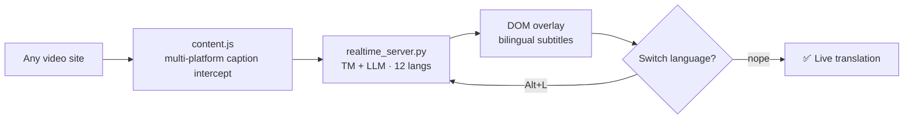
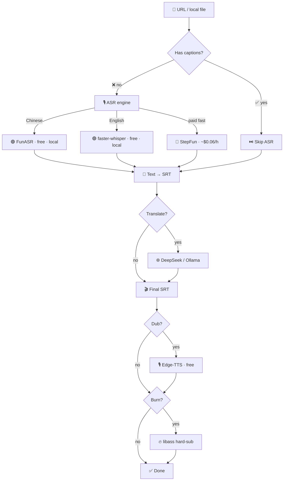

# Everyones Video — Real-time Subtitles + Offline Pipeline 🎬

[](LICENSE)
[](https://github.com/hanshaoyuyehanshaoyuye/everyones-video/tree/main/extension)
[](https://github.com/hanshaoyuyehanshaoyuye/everyones-video/blob/main/tests/test_core.py)
[](https://python.org)
[](https://ghcr.io)
[]()


> **Two modes + 12 languages. Real-time browser translation + one-command offline pipeline. Free first, MIT open source.**

**Chrome Extension**: Auto bilingual subtitles on YouTube/Bilibili/Vimeo — zero download, zero wait. **Offline Pipeline**: URL or local file → finished subtitled video in one command.

---

## Why Everyones Video

**MIT license. Chrome real-time. 12 languages. Free tier that actually works. Docker. Security-hardened. Nobody else has all six.**

| Feature | Everyones Video | pyvideotrans | VideoLingo | Mazinger |
|---------|:--:|:--:|:--:|:--:|
| **License** | **MIT** | GPL-3.0 | Apache 2.0 | ? |
| **Chrome real-time** | **✅** | — | — | — |
| **12 languages** | **✅ CJK+RU+DE+FR+ES+PT+AR** | partial | partial | — |
| **¥0 end-to-end** | **✅** | needs API | needs API | needs API |
| **Docker + API** | **✅** | — | — | — |
| **Translation memory** | **✅** | — | — | — |
| **SQI quality engine** | **✅** | — | — | — |
| **Security hardened** | **✅** | — | — | — |
| Speaker diarization | ✅ FunASR + WhisperX | ✅ | ✅ | — |
| Translation QA | ✅ GEMBA-MQM | — | ✅ | — |
| TTS | ✅ Edge-TTS | ✅ 3 engines | — | — |

> **MIT means:** embed in your product, run as SaaS, fork and modify — no obligation to open source your changes.

Also check out: [pyvideotrans](https://github.com/jianchang512/pyvideotrans) (18k★, GUI + voice cloning), [VideoLingo](https://github.com/Huanshere/VideoLingo) (17.5k★, Netflix-quality subs), [Mazinger](https://github.com/bakrianoo/mazinger) (10-stage pipeline).

---

## 12-Language Translation

**Any direction between: 中文 · English · 日本語 · 한국어 · Русский · Deutsch · Français · Español · Português · العربية.**

- **Chrome Extension**: auto-detect or manual, `Alt+L` to switch languages
- **Offline**: `python3 integration/translate_srt.py input.srt --to ja`
- **LLM backends**: DeepSeek / OpenAI / Ollama — any OpenAI-compatible API

---

## Chrome Real-time Translation (v6.2)

**Open any video site → auto bilingual subtitles. No download. No ASR cost.**

| Platform | Subtitle source | Method |
|----------|----------------|--------|
| **YouTube** | timedtext API | XML intercept |
| **Bilibili** | player API | getCaptions() + subtitle API |
| **Vimeo / Coursera / …** | `<track>` WebVTT | auto-fetch |
| **Any site** | XHR/fetch responses | SRT/VTT/JSON pattern match |

```
Any <video> page
    │
    ▼
Platform detection → subtitle adapter
    │
    ├─ YouTube → intercept timedtext XML
    ├─ Bilibili → player.getCaptions()
    ├─ <track>  → fetch WebVTT
    └─ Generic  → XHR/fetch pattern match
    │
    ▼
POST /translate/batch → realtime_server.py
    │
    ├─ TM hit → <1ms return
    └─ TM miss → LLM translate → cache to TM
    │
    ▼
rAF poll currentTime → cue match → DOM overlay
```

### 30-Second Setup

```bash
# 1. Start translation backend
export DEEPSEEK_API_KEY=sk-...
python3 integration/realtime_server.py &

# 2. Load extension
# Chrome → Extensions → Developer mode → "Load unpacked" → pick extension/
```

**Features**: YouTube · Bilibili · Vimeo · any `<track>` source · 12 languages · `Alt+T` toggle · `Alt+L` switch language · TM cache means second watch is free.

---

## Offline Pipeline (One Command)

```bash
bash integration/pipeline.sh "https://youtube.com/watch?v=dQw4w9WgXcQ" --translate --dub --burn
```

```
════════════════════════════════════
 Video Subtitle Pipeline
 Language: zh | ASR: auto
 Translate: true | Dub: true | Burn: true
════════════════════════════════════

═══ Step 1: Extract audio + subtitle check ═══
  → YouTube auto-captions found! Skipping ASR
  → subtitles.srt (142 entries)

═══ Step 4: Translate ═══
  → subtitles_translated.srt (142 entries)

═══ Step 5: TTS dub ═══
  → dub.mp3

═══ Step 6: Burn subtitles ═══
  → tutorial_subtitled.mp4

════════════════════════════════════
 Done!
════════════════════════════════════
```

---

## Flow

### Real-time (Chrome Extension)



### Offline Pipeline



---

## Install

### Option 1: git clone (recommended)

```bash
git clone https://github.com/hanshaoyuyehanshaoyuye/everyones-video
cd everyones-video
pip install -r requirements.txt
```

### Option 2: Docker

```bash
docker build -t everyones-video .
docker run --rm \
    -v $(pwd)/work:/app/work \
    -e DEEPSEEK_API_KEY=$DEEPSEEK_API_KEY \
    everyones-video \
    "https://youtube.com/watch?v=VIDEO_ID"
```

---

## ASR Engine Comparison

| Engine | Cost | Chinese | English | Speed | Timestamps | Speaker | Offline |
|--------|:--:|:--:|:--:|:--:|:--:|:--:|:--:|
| **FunASR** (Alibaba) | 🟢 free | ⭐⭐⭐ | ⭐ | ~15× | ✅ | ✅ cam++ | ✅ |
| **faster-whisper** (CTranslate2) | 🟢 free | ⭐⭐ | ⭐⭐⭐ | ~50× | ✅ | ✅ WhisperX | ✅ |
| yt-dlp caption extract | 🟢 free | — | — | 1s | ✅ | — | ❌ |
| StepFun | ~$0.06/h | ⭐⭐ | ⭐⭐ | ~90× | ❌ | — | ❌ |
| Whisper API | $0.006/min | ⭐⭐ | ⭐⭐⭐ | ~15× | ✅ | — | ❌ |

---

## 10 Use Cases (All Free or Nearly Free)

| # | Scenario | Cost |
|---|----------|------|
| 1 | YouTube real-time bilingual subtitles | **¥0** |
| 2 | English tutorial → Chinese-subbed video | ¥0 |
| 3 | Chinese meeting recording → transcript | ¥0 |
| 4 | Chinese short video → English version | ¥0~0.01 |
| 5 | Batch 100 videos → subtitles | ~¥15 |
| 6 | Podcast MP3 → transcript + timestamps | ¥0 |
| 7 | 1 video → 5 language subtitles | ~¥0.03 |
| 8 | Fully offline (no network) | ¥0 |
| 9 | 30s audio quick test | ¥0 |
| 10 | Directory batch processing | ~¥0 |

---

## Quick Start

```bash
# Install
pip install -r requirements.txt

# Your first video
bash integration/pipeline.sh "https://youtube.com/watch?v=dQw4w9WgXcQ"

# Translate + dub + burn
bash integration/pipeline.sh ~/tutorial.mp4 --lang en --translate --dub --burn

# Use individual modules
python3 integration/translate_srt.py input.srt --to en --bilingual
python3 integration/tm.py stats
python3 integration/tts_dub.py subtitles.srt --lang en -o dub.mp3

# Quality check (SQI)
python3 integration/subtitle_quality.py subtitles.srt --lang zh --fix
```

**Swap translation backend** — any OpenAI-compatible API:

```bash
# OpenAI
export TRANSLATE_API_BASE=https://api.openai.com
export TRANSLATE_MODEL=gpt-4o-mini

# Local Ollama (free)
export TRANSLATE_API_BASE=http://127.0.0.1:11434/v1
export TRANSLATE_MODEL=qwen3:14b
```

---

## Directory

| File | Purpose |
|------|---------|
| [integration/pipeline.sh](integration/pipeline.sh) | One-command pipeline |
| [extension/](extension/) | Chrome real-time translation extension |
| [integration/realtime_server.py](integration/realtime_server.py) | Real-time translation server (TM + LLM) |
| [integration/funasr_run.py](integration/funasr_run.py) | Free Chinese ASR (FunASR + speaker diarization) |
| [integration/faster_whisper_run.py](integration/faster_whisper_run.py) | Free English ASR (faster-whisper + WhisperX) |
| [integration/translate_srt.py](integration/translate_srt.py) | SRT translation + TM cache + API server |
| [integration/tm.py](integration/tm.py) | Translation memory (exact + fuzzy, zero deps) |
| [integration/reflect_fix.py](integration/reflect_fix.py) | Translation QA fix loop (GEMBA-MQM → LLM → re-score) |
| [integration/tts_dub.py](integration/tts_dub.py) | SRT → TTS (Edge-TTS) |
| [integration/eval_quality.py](integration/eval_quality.py) | GEMBA-MQM translation quality scoring |
| [integration/subtitle_quality.py](integration/subtitle_quality.py) | SQI subtitle quality engine |
| [integration/batch_pipeline.sh](integration/batch_pipeline.sh) | Batch processing with parallelism |
| [skills/](skills/) | Four Claude Code skills |
| [Dockerfile](Dockerfile) | Multi-stage Docker image |
| [docs/](docs/) | Architecture, engine comparison, cost guide, workflows |

---

## Four Claude Code Skills

| Skill | Trigger | What it does |
|-------|---------|--------------|
| **wjs-transcribing-audio** | transcribe / make SRT | Audio → SRT |
| **wjs-translating-subtitles** | translate this SRT | SRT translation |
| **wjs-dubbing-video** | dub / TTS | SRT → speech |
| **wjs-burning-subtitles** | burn subtitles | Hard-sub to video |

---

## License

MIT — do whatever you want. Embed it, sell it, fork it. No strings attached.

---

# 中文说明

> **两大模式 + 12 语种：实时翻译 + 离线出片。免费优先，MIT 开源。**

**Chrome 扩展**：打开 YouTube/Bilibili 自动双语字幕，12 语种任意互译，零下载零等待。
**离线管线**：一句话从 URL/文件到成品视频，Claude Code 技能 + 独立 CLI 双模。

## 为什么选 everyones-video

**免费优先、MIT 许可、Chrome 实时翻译、Docker 就绪、安全加固 — 五张牌同时具备的只有我们。**

| 能力 | everyones-video | pyvideotrans | VideoLingo |
|------|:--:|:--:|:--:|
| **许可** | **MIT** | GPL-3.0 | Apache 2.0 |
| **Chrome 实时翻译** | **✅ v6.2** | — | — |
| **12 语种翻译** | **✅** | 部分 | 部分 |
| **整管线 ¥0 跑通** | **✅** | 需配 API | 需配 API |
| **Docker + API Server** | **✅** | — | — |
| **翻译记忆库 TM** | **✅** | — | — |
| **SQI 字幕质量引擎** | **✅ v8.0** | — | — |
| **安全加固** | **✅** | — | — |

> **MIT 许可：** 嵌入产品、SaaS 服务、二次开发 — 都无需开源你的代码。

## 30 秒安装

```bash
# 1. 启动翻译后端
export DEEPSEEK_API_KEY=sk-...
python3 integration/realtime_server.py &

# 2. 加载扩展
# Chrome → 扩展程序 → 开发者模式 → "加载已解压的扩展程序" → 选 extension/ 目录

# 3. 打开任意视频网站，开启字幕
```

## 一条命令出片

```bash
bash integration/pipeline.sh "https://youtube.com/watch?v=dQw4w9WgXcQ" --translate --dub --burn
```

## 10 个场景

| # | 场景 | 成本 | 引擎 |
|---|------|------|------|
| 1 | YouTube 实时双语字幕 | **¥0** | Chrome Extension |
| 2 | YouTube 英文教程 → 中英双语出片 | ¥0 | yt-dlp 字幕 |
| 3 | 中文会议录音 → 文字纪要 | ¥0 | FunASR |
| 4 | 中文短视频 → 英文版出片 | ¥0~0.01 | FunASR |
| 5 | 批量 100 个视频 → 字幕 | ~¥15 | 豆包 |
| 6 | 播客 MP3 → 文字稿 + 时间轴 | ¥0 | FunASR |
| 7 | 1 视频 → 5 语言字幕 | ~¥0.03 | DeepSeek + TM |
| 8 | 纯本地离线（零网络） | ¥0 | FunASR |
| 9 | 30 秒语音 → 入门测试 | ¥0 | FunASR |
| 10 | 目录批量处理 | ~¥0 | batch_pipeline.sh |

## 引擎对比

| 引擎 | 价格 | 中文 | 英文 | 速度 | 离线 |
|------|:--:|:--:|:--:|:--:|:--:|
| **FunASR** 阿里达摩院 | 🟢 免费 | ⭐⭐⭐ | ⭐ | ~15× | ✅ |
| **faster-whisper** CTranslate2 | 🟢 免费 | ⭐⭐ | ⭐⭐⭐ | ~50× | ✅ |
| yt-dlp 字幕提取 | 🟢 免费 | — | — | 1s | ❌ |
| StepFun | ~0.4元/h | ⭐⭐ | ⭐⭐ | ~90× | ❌ |

## 同赛道优秀项目

[pyvideotrans](https://github.com/jianchang512/pyvideotrans)（18k★，GUI + 声克隆）、[VideoLingo](https://github.com/Huanshere/VideoLingo)（17.5k★，Netflix 级字幕质量）、[Mazinger](https://github.com/bakrianoo/mazinger)（10 段式管线）。各有千秋，按需选择。
